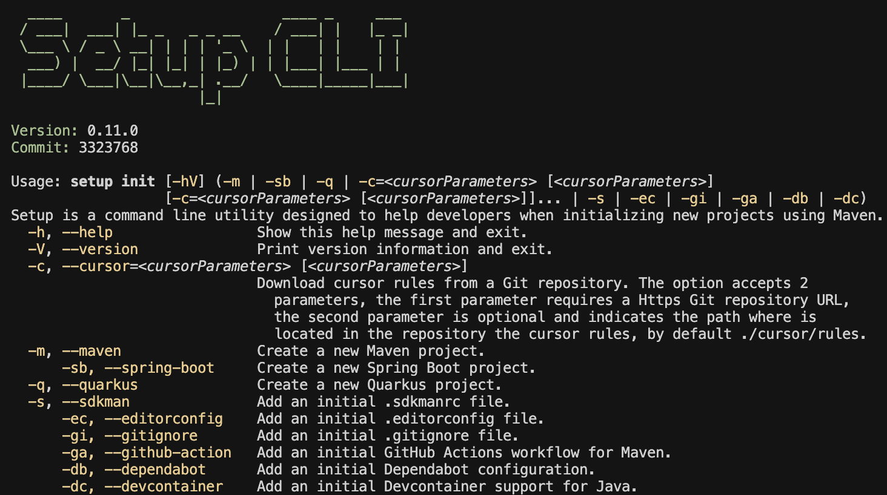

# Setup CLI

Setup is a Command line utility designed to help developers when they start working with a new repository using Maven.

[](https://github.com/jabrena/setup-cli/actions/workflows/maven.yaml)



## Motivation

PENDING

## Getting started

PENDING

## How to build in local

```bash
sdk env install

# Update cursor rules in local
./manage_submodules.sh r java
./manage_submodules.sh r tasks
./manage_submodules.sh r agile
touch .gitmodules
./manage_submodules.sh c java
./manage_submodules.sh c tasks
./manage_submodules.sh c agile

# Setup cli
./mvnw dependency:tree
./mvnw dependency:resolve
./mvnw clean validate -U
./mvnw buildplan:list-phase
./mvnw license:third-party-report
jwebserver -p 8001 -d "$(pwd)/target/reports/"
./mvnw clean verify
./mvnw clean verify -Dmaven.build.cache.enabled=false
./mvnw clean verify -Dmaven.build.cache.enabled=false -DENABLE_INTEGRATION_TESTS=true
jwebserver -p 8001 -d "$(pwd)/target/timeline/"
./mvnw clean test surefire-report:report -Dmaven.test.failure.ignore=true
jwebserver -p 8004 -d "$(pwd)/target/reports"
./mvnw clean verify jacoco:report -Pjacoco
jwebserver -p 8004 -d "$(pwd)/target/site/jacoco"
./mvnw clean verify -Ppitest
./mvnw clean verify -Psecurity

./mvnw versions:display-property-updates
./mvnw versions:display-dependency-updates
./mvnw versions:display-plugin-updates

./mvnw versions:set -DnewVersion=0.11.0
./mvnw versions:commit
```

## How to use the CLI

```bash
./mvnw clean package
./mvnw clean package -DskipTests
./mvnw clean package -Dmaven.build.cache.enabled=false
java -jar ./target/setup-0.11.0.jar
java -jar ./target/setup-0.11.0.jar --help
java -jar ./target/setup-0.11.0.jar init
java -jar ./target/setup-0.11.0.jar init --help
java -jar ./target/setup-0.11.0.jar init --devcontainer
java -jar ./target/setup-0.11.0.jar init --cursor java
java -jar ./target/setup-0.11.0.jar init --cursor spring-boot
java -jar ./target/setup-0.11.0.jar init --cursor quarkus
java -jar ./target/setup-0.11.0.jar init --cursor tasks
java -jar ./target/setup-0.11.0.jar init --cursor agile
java -jar ./target/setup-0.11.0.jar init --maven
java -jar ./target/setup-0.11.0.jar init --spring-boot
java -jar ./target/setup-0.11.0.jar init --quarkus
java -jar ./target/setup-0.11.0.jar init --github-action
java -jar ./target/setup-0.11.0.jar init --editorconfig
java -jar ./target/setup-0.11.0.jar init --sdkman
java -jar ./target/setup-0.11.0.jar init --visualvm
java -jar ./target/setup-0.11.0.jar init --jmc
java -jar ./target/setup-0.11.0.jar init --gitignore
jar tf ./target/setup-0.11.0.jar
```

## How to use from Jbang

```bash
jbang cache clear
jbang catalog list jabrena
jbang setup@jabrena
```

## Release process

```bash
git tag -l --sort=-creatordate --format='%(refname:short) - %(creatordate:format:%d/%m/%Y)'
```

## References

- https://picocli.info/
- https://github.com/jbangdev/jbang-jash
- https://containers.dev/
- https://sdkman.io/
- https://sdkman.io/usage/#env-command
- https://sdkman.io/sdks/jmc
- https://sdkman.io/sdks/visualvm
- https://maven.apache.org/guides/index.html
- https://maven.apache.org/guides/getting-started/maven-in-five-minutes.html
- https://docs.spring.io/spring-boot/cli/index.html
- https://quarkus.io/blog/quarkus-cli/
- https://keepachangelog.com/en/1.1.0/
- https://www.eclemma.org/jacoco/trunk/doc/maven.html
- https://www.cursor.com/
- https://docs.cursor.com/context/rules-for-ai
- https://github.com/zeroturnaround/zt-exec
- ...
- https://github.com/jabrena/cursor-rules-methodology
- https://github.com/jabrena/cursor-rules-agile
- https://github.com/jabrena/cursor-rules-tasks
- https://github.com/jabrena/cursor-rules-java
- https://github.com/jabrena/cursor-rules-examples
- https://github.com/jabrena/101-cursor
- https://github.com/jabrena/setup-cli
- https://github.com/jabrena/jbang-catalog

Powered by [Cursor](https://www.cursor.com/)
