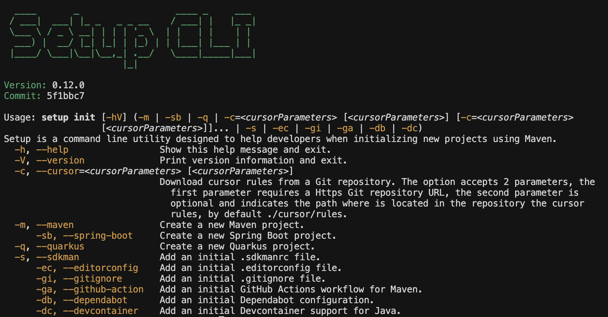

# Setup CLI

Setup is a command line utility designed to help developers when initializing new projects using Maven.

[](https://github.com/jabrena/setup-cli/actions/workflows/maven.yaml)



## Motivation

**Time is precious in software development**, and setting up a new repository shouldn't consume hours of your productive time. Every new project requires the same tedious setup tasks: configuring build systems, setting up CI/CD pipelines, adding development environment configurations, choosing Java versions, and more.

When starting a new repository, you face familiar challenges: creating a Maven project (but who remembers the complete archetype command?), revisiting the classic [Maven in 5 minutes](https://maven.apache.org/guides/getting-started/maven-in-five-minutes.html) guide, or memorizing framework-specific options for [Spring Boot](https://docs.spring.io/spring-boot/cli/index.html) or [Quarkus](https://quarkus.io/blog/quarkus-cli/). Why not start with sensible defaults and customize the **pom.xml** later?

These setup tasks aren't complex, but they are genuinely tedious. Whether you build from scratch or copy from previous projects, you typically lose at least an hour during repository onboarding.

This tool streamlines the process by providing battle-tested defaults for Devcontainers, GitHub Actions, `.editorconfig`, `.sdkmanrc`, and more—all ready to use with a simple `jbang setup@jabrena init` command. You might discover configurations you didn't even know you needed.

**If you value efficient project onboarding**, Setup CLI is designed for developers like you.

---

**Work in Progress:** I'm currently developing advanced features that, while not essential for initial project setup, represent best practices for preventing issues like memory leaks in production environments. These upcoming features will integrate powerful diagnostic tools such as [Java Mission Control (JMC)](https://www.oracle.com/java/technologies/jdk-mission-control.html) and [VisualVM](https://visualvm.github.io/), helping developers proactively monitor and optimize their applications.

## Getting started

This command line tool was designed to be executed in combination **Jbang** a nice way to develop small programs like this. To use Setup, you will need to have installed JBang first, so how to install JBang?

```bash
sdk install jbang
```

Once you have instaled **JBang**, I recommend to clear the cache to use latest version of setup:

```bash
jbang cache clear
jbang catalog list jabrena
```

After this quick operation, it is your turn!

```bash
# Show all options
jbang setup@jabrena init --help

# Create a Maven from Scratch using a maven archetype
jbang setup@jabrena init --maven

# Create an initial Servlet Spring boot REST API maven project example
jbang setup@jabrena init --spring-boot

# Create an initial Quarkus maven project
jbang setup@jabrena init --quarkus

# Add cursor rules for Agile/Scrum in ./cursor/rules
jbang setup@jabrena init --cursor https://github.com/jabrena/cursor-rules-agile

# Add cursor rules for Java in ./cursor/rules
jbang setup@jabrena init --cursor https://github.com/jabrena/cursor-rules-java

# Add the popular Cursor rules for Tasks from Ryan Carson
jbang setup@jabrena init --cursor https://github.com/snarktank/ai-dev-tasks .

# Another cursor rules example
jbang setup@jabrena init --cursor https://your-awesome-cursor-rules-repository ./cursor/rules

# Add a .sdkmanrc file to indicate with Java//Maven version you are going to use
jbang setup@jabrena init --sdkman

# Add a .editorconfig file
jbang setup@jabrena init --editorconfig

# Add an initial Github Action pipeline for Maven
jbang setup@jabrena init --github-action

# Add an initial .gitignore file
jbang setup@jabrena init --gitignore

# Add an initial Dependabot.yaml file
jbang setup@jabrena init --dependabot

# Add an initial Devcontainer configuration
jbang setup@jabrena init --devcontainer
```

If you have any doubt, you can create an issue here: https://github.com/jabrena/setup-cli/issues

## How to contribute

Review this [document](./README-DEV.md)

## References

- https://maven.apache.org/guides/index.html
- https://maven.apache.org/guides/getting-started/maven-in-five-minutes.html
- https://docs.spring.io/spring-boot/cli/index.html
- https://quarkus.io/blog/quarkus-cli/
- https://editorconfig.org/
- https://sdkman.io/
- https://sdkman.io/usage/#env-command
- https://sdkman.io/sdks/jmc
- https://sdkman.io/sdks/visualvm
- https://github.com/features/actions
- https://visualvm.github.io/
- https://www.oracle.com/java/technologies/jdk-mission-control.html
- https://containers.dev/
- https://www.cursor.com/
- https://docs.cursor.com/context/rules-for-ai
- ...
- https://github.com/jabrena/cursor-rules-methodology
- https://github.com/jabrena/cursor-rules-agile
- https://github.com/jabrena/cursor-rules-java
- https://github.com/jabrena/cursor-rules-examples
- https://github.com/jabrena/101-cursor
- https://github.com/jabrena/setup-cli
- https://github.com/jabrena/jbang-catalog

Powered by [Cursor](https://www.cursor.com/)

